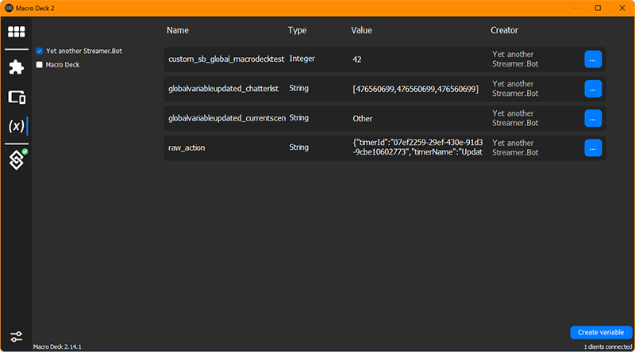
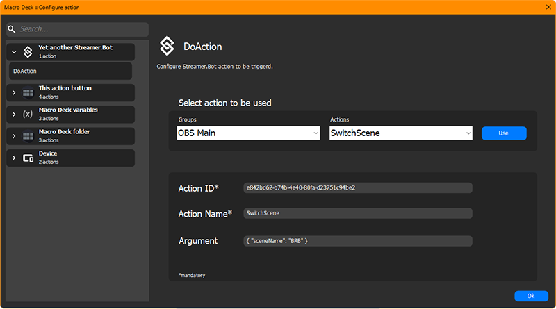

# Macro Deck YaSB Plugin
Yet another Streamer.Bot plugin for Macro Deck.

## Manual Installation
Go to the [releases](https://github.com/dichternebel/macrodeck-yasb-plugin/releases) and download the latest version.  
Open Macro Deck, go to the Plugins tab and click on the `Install from file` button.  

By default the plugin listens to `General.Custom` and `Misc.GlobalVariableUpdated` events. Configure the plugin to match your Streamer.Bot websocket server settings and you're good to go!

## Usage

The plugin will automatically connect to the Streamer.Bot websocket server and listen for events configured in the plugin settings. It will get all available actions that may be triggered on application start or when the websocket connection is established.

## Configuration in Streamer.Bot

The Streamer.Bot websocket server has to run. When you use authentication in Streamer.Bot make sure to use the same password in the settings. Click on the eye symbol to be sure!

## Events
You can configure the plugin to listen to all available events in Streamer.Bot. Events that are not selected in the plugin `Events` setting will be ignored. If you are not intrested in using events you can completely uncheck all events.

## Variables
Every Streamer.Bot event you have subscribed to will result in a variable being created in Macro Deck as soon as a message is received by the plugin.

The plugin will not transform any event messages by default, instead it will create variable values in raw `JSON` format.  
If you want to transform the raw values you can use the plugin configuration called `f(x)` to store the variable value by a given key of your choice.

Variable names are stored in the format `actionName_variableName` in lower case:

## Actions
The plugin comes with a Macro Deck action called `DoAction` that can be used to execute any existing action in Streamer.Bot:

To configure the Macro Deck action, you need to enter the `Action ID` and the `Action Name` of the Streamer.Not Action you want to trigger or you can select the group of the action in the first combobox and then select the action in the second combobox and click on `Use`.

The `Argument` field is optional and can be used to pass an argument to the action. It has to be in valid `JSON` format like `{ "value": 42 }` or like seen in the screenshot above.

## Requirements
- Streamer.Bot 0.2.5 or higher
- Macro Deck 2.14.1 or higher
